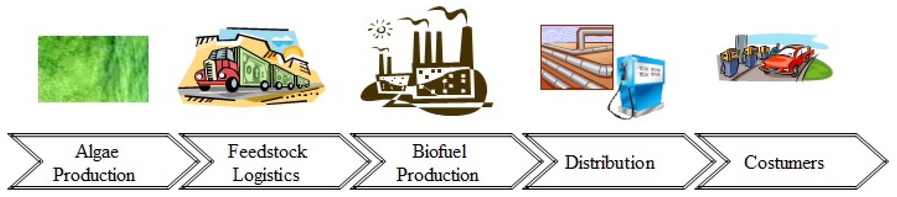
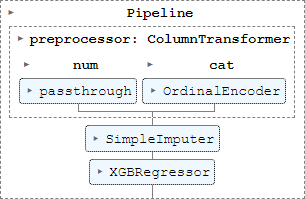
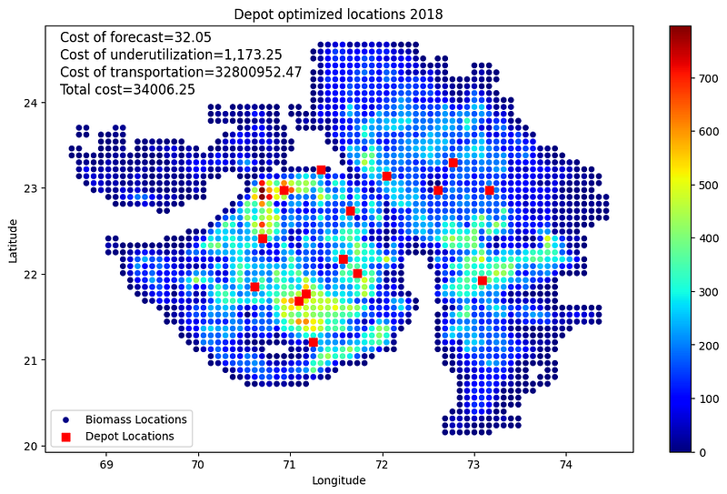
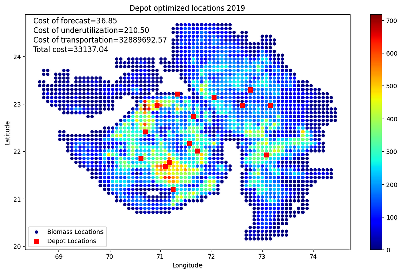

  

    <h1 align="center">Green Energy Forecasting and Optimizer</h1>

	
	
	

	
	

This project was inspired by the [Shell AI Hackathon 2023 - Waste to Energy](https://www.shell.com/what-we-do/digitalisation/collaboration-and-open-innovation/shell-ai-hackathon-for-sustainable-and-affordable-energy-past-editions.html)

## Overview

This project leverages **Machine Learning** and **Optimization** techniques to minimize the cost of biofuel production in Gujarat, India. The project involves forecasting biomass annual production at 2418 harvesting sites using machine learning models and selecting optimal depot locations using a hybrid Simulated Annealing and Variable Neighborhood Search algorithm. The primary goal is to minimize the total cost of biofuel production optimizing the supply chain, which includes the cost of biomass collection and transportation.

  

## Project Structure

- ### **`notebook.ipynb`: Main Jupyter notebook.**

- `dataset/`: Contains all the data files used in the project.
  - `Biomass_History.csv`: Historical biomass data.
  - `Distance_Matrix.csv`: Distance matrix between sites.
  - `biomass_long.csv`: Long format biomass data.
  - `districts.csv`: District information.
  - `cropland/`: Cropland data.
  - `elevation/`: Elevation data download links.
  - `rainfall/`: Rainfall data download links.

- `docs/`: Contains the detailed problem statement.
  - `detailed-problem-statement.pdf`: Detailed problem statement document.

- `feature_engineering/`: Scripts and notebooks for feature engineering.
  - `cropland.ipynb`, `cropland.py`: Cropland feature engineering.
  - `district.py`: District feature engineering.
  - `elevation.py`: Elevation feature engineering.
  - `fe_utils.py`: Utility functions for feature engineering.
  - `rainfall.py`: Rainfall feature engineering.

- `modelling/`: Scripts for model training, testing, tuning, and plotting.
  - `plotting.py`: Plotting functions.
  - `test.py`: Testing scripts.
  - `training.py`: Training scripts.
  - `tuning.py`: Hyperparameter tuning scripts.
  - `logs/`: Contains results logs.
    - `results.csv`: Results of model training and testing.

- `models/`: Trained models and related data.
  - `full_data.csv`: Full dataset used for training.
  - `xgb_best.pkl`: Best trained model (XGBoost).

- `optimization/`: Scripts for optimization algorithms.
  - `cost_functions.py`: Cost functions used in optimization.
  - `optimization.py`: Implementation of the optimization algorithm.

- `scripts/`: Miscellaneous scripts.
  - `add_districts.ipynb`: Script of the district data.
  - `add_precipitation_rate.ipynb`: Script of the precipitation rate data.
  - `download_parallel.py`: Script for parallel data downloading.
- `utils.py`: Utility functions.

## Methodology

### Biomass Forecasting

#### 1. **Data Collection**: 
- Gathered historical biomass data, cropland data, elevation data, and rainfall data.
    - Crop land data from [EarthStat](http://www.earthstat.org/) 
    - Elevation and rainfall/precipitation (not used) data from **NASA** Earth Observation [NEO](https://neo.gsfc.nasa.gov/dataset_index.php#energy) are integrated into the analysis.
    - District information from shapefiles `dataset/districts`
#### 2. **Model Training**: 
Trained various machine learning models to forecast biomass at the 2418 harvesting sites. The XGBoost model was found to be the best performing. The model pipeline consists in OrdinalEncoder on the categorical variables and a median imputer.

  

#### 3. Model Results

| Year | Test MAE |
| ---- | -------- |
| 2011 | 28.4     |
| 2012 | 58.03    |
| 2013 | 43.15    |
| 2014 | 31.56    |
| 2015 | 30.82    |
| 2016 | 48.03    |
| 2017 | 38.41    |
| 2018 | 32.05    |
| 2019 | 36.85    |
| Avg  | 38.57    |

### Depot Location Optimization

1. **Problem Definition**: Selecting depot locations to minimize total cost, including biomass collection and transportation costs.
2. **Algorithm Design**: Developed a hybrid algorithm combining Simulated Annealing and Variable Neighborhood Search to find the optimal depot locations.
3. **Implementation**: Implemented the algorithm in `optimization/optimization.py`.
4. **Results**: The algorithm successfully identified optimal depot locations, resulting in significant cost savings.

  

  

## Main Results

- The XGBoost model achieved satisfactory error in forecasting biomass availability, with a **MAE** of **32.05** in 2018 and **36.85** in 2019.
- The hybrid optimization algorithm reduced the total cost of biofuel production by **34.45%** for 2018 and **34.86%** for 2019 compared to greedy methods.

| Year | Greedy cost | Best cost | Reduction (%) |
| ---- | ----------- | --------- | ------------  |
| 2018 | 51879.16    | 34006.25  |    34.45      |
| 2019 | 50872.53    | 33137.04  |    34.86      |

## Business Impact

- **Cost Reduction**: The project significantly reduced the total cost of biofuel production, enhancing the economic viability of biofuel as an alternative energy source.
- **Efficiency Improvement**: Optimized depot locations led to more efficient logistics, reducing transportation costs and time.
- **Scalability**: The methodologies developed in this project can be scaled to other regions and similar logistics problems in the biofuel industry.
